# Baseline Results

This page summarizes the PolliFlower baseline results under the Standard and Challenging protocols.

`data_standard` corresponds to the Standard Protocol, and `data_hard` corresponds to the Challenging Protocol. Higher values are better for Precision, Recall, mAP, IoU, StrictIoU, Pose mAP50, and StrictPCK. Lower values are better for StrictDist.

## Qualitative Examples

The following examples show baseline predictions on public sample images. These visualizations are provided for qualitative inspection only; full benchmark reproduction requires access to the complete PolliFlower dataset.

### Flower Instance Detection

**Standard Protocol**

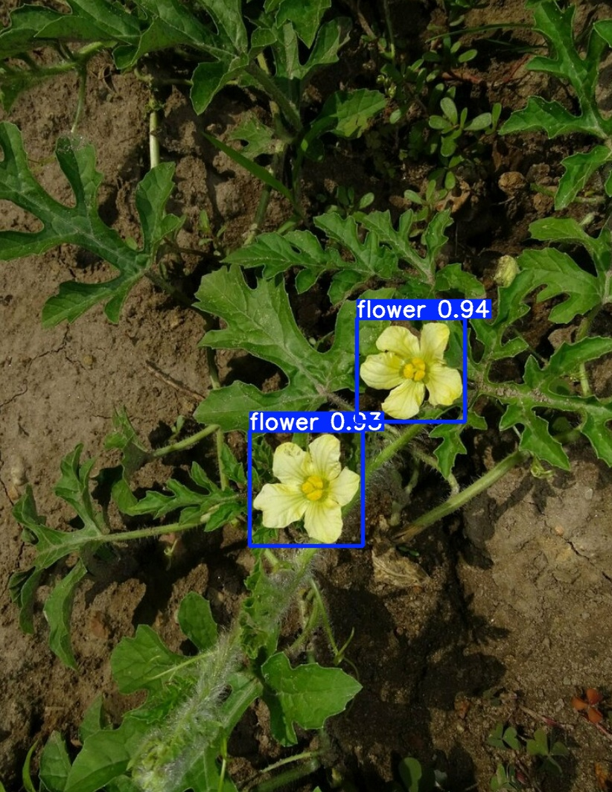

**Challenging Protocol**

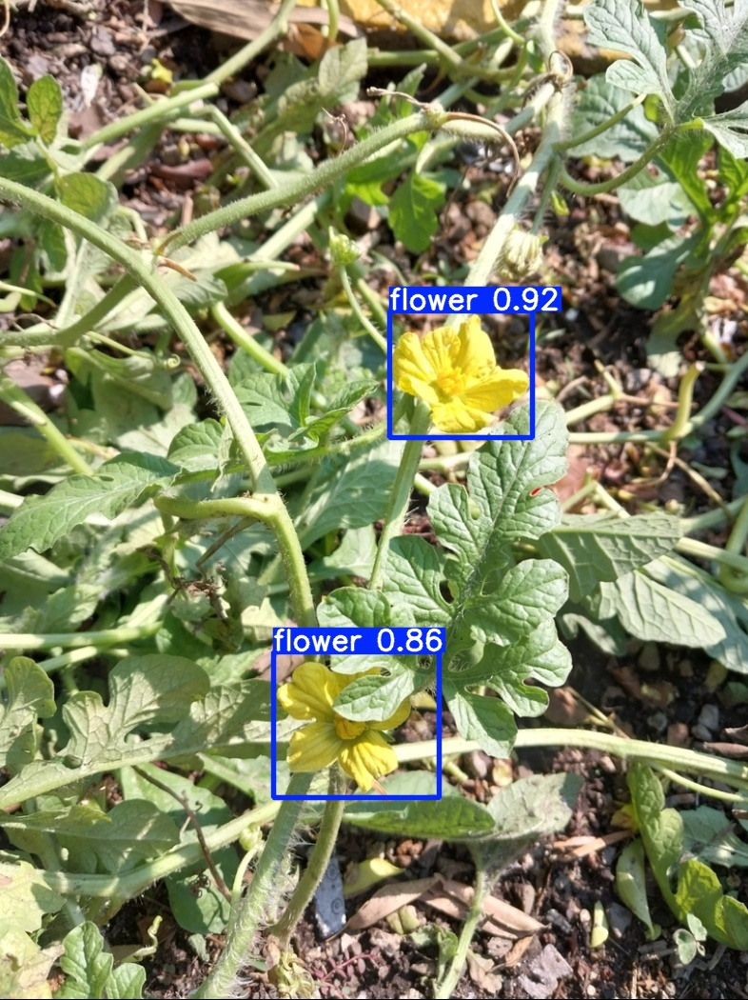

### Stigma Instance Segmentation

**Standard Protocol**

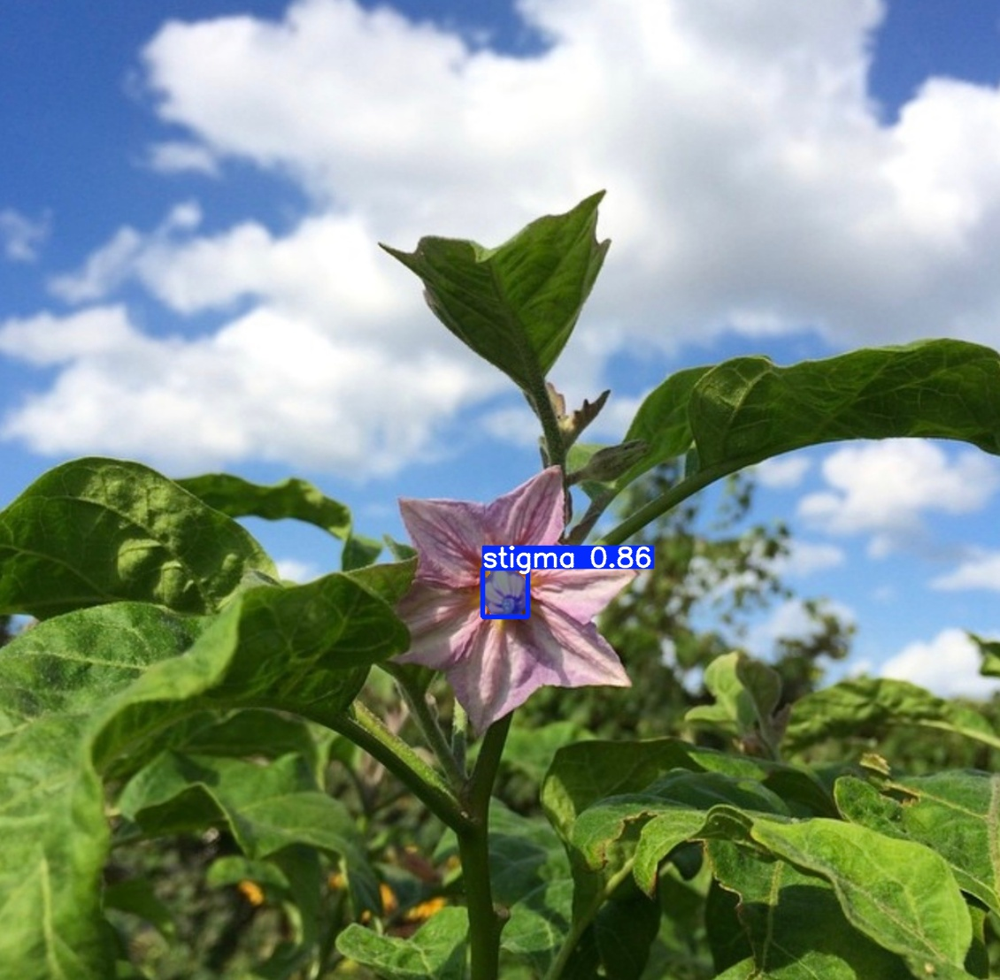
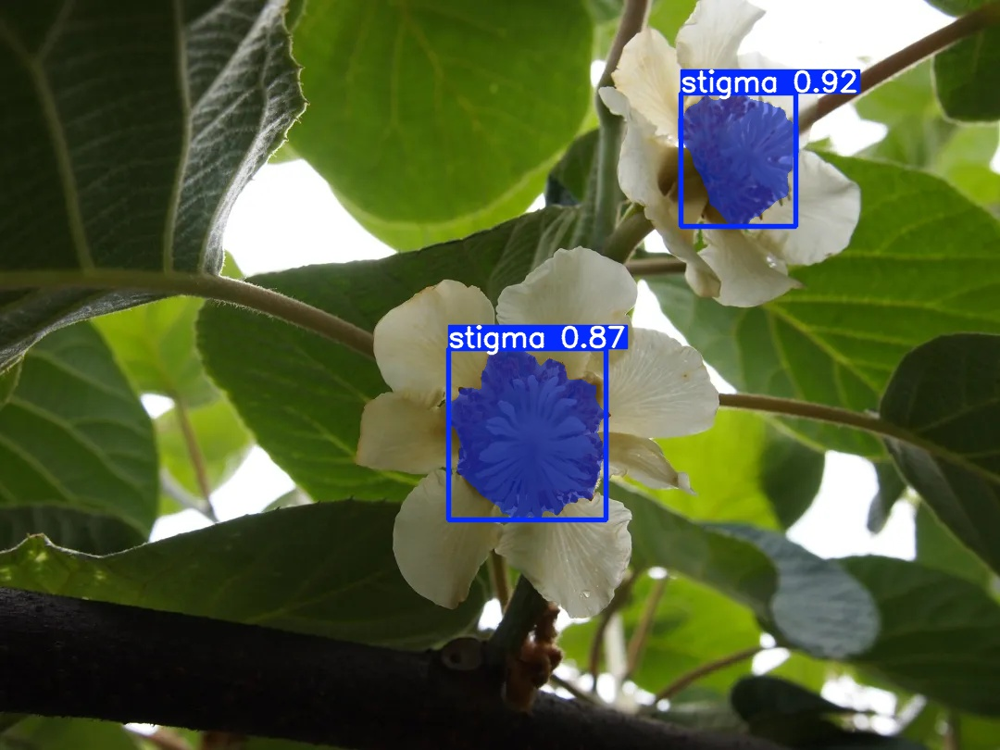
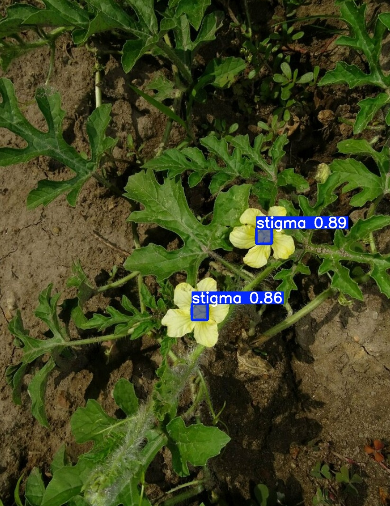

**Challenging Protocol**

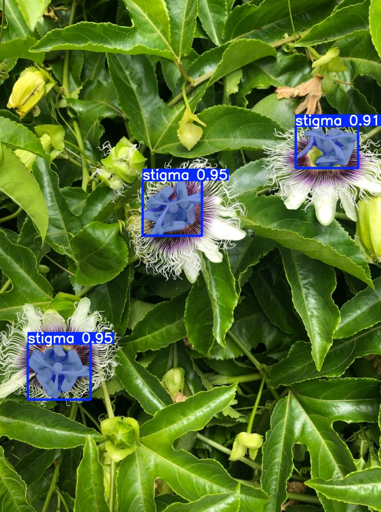
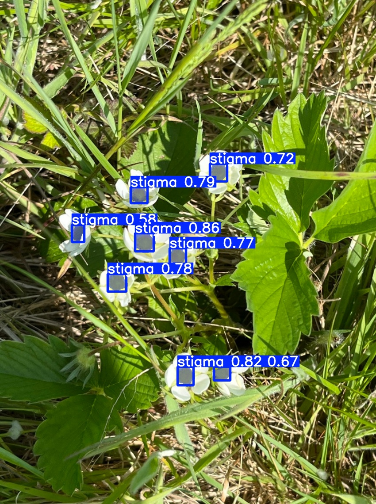
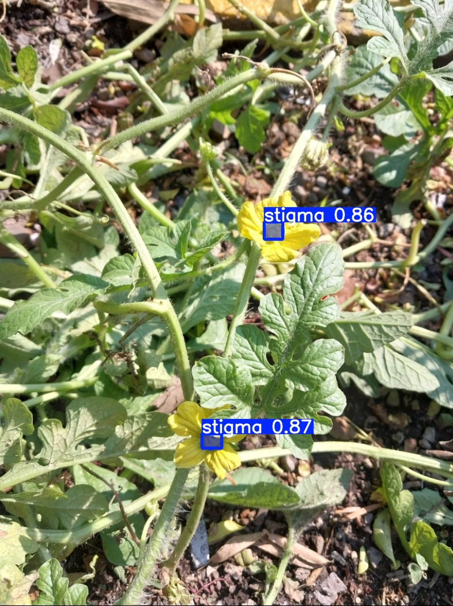

### Pollination Point Localization

**Standard Protocol**

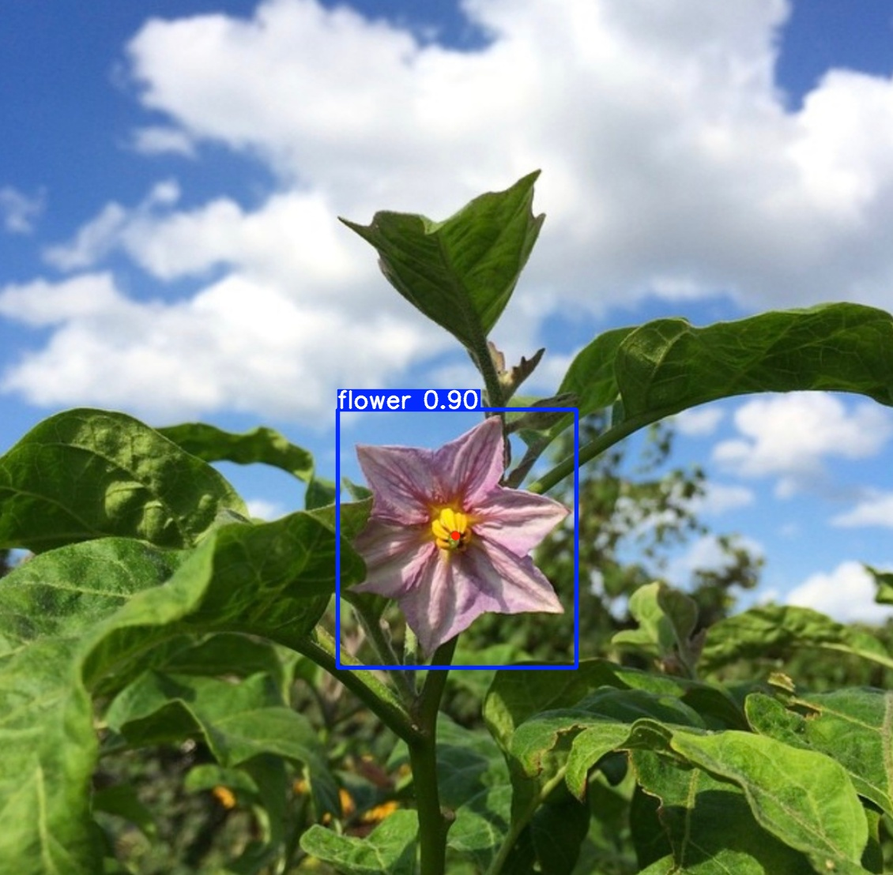
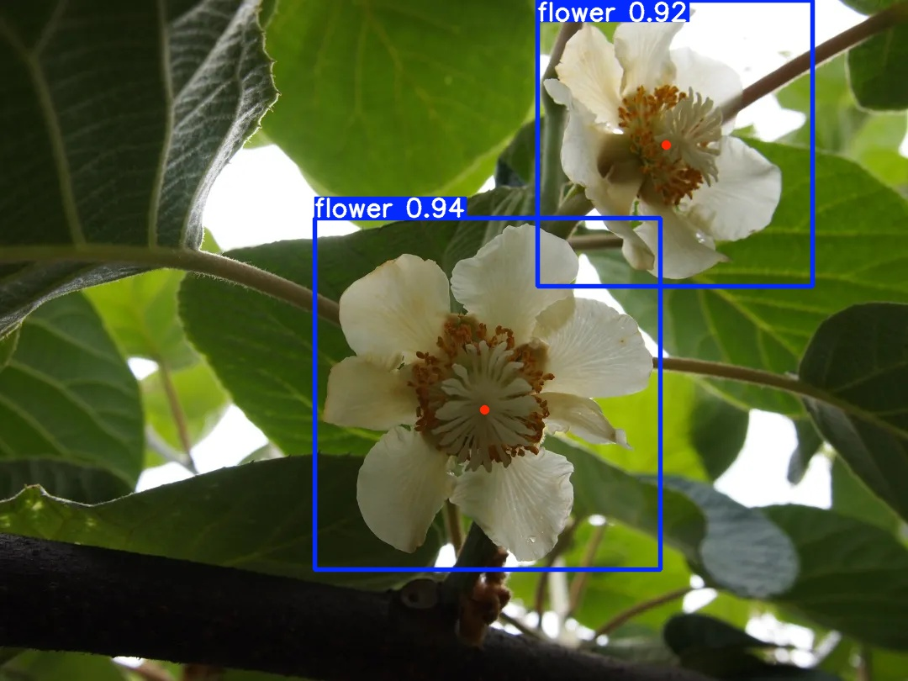

**Challenging Protocol**

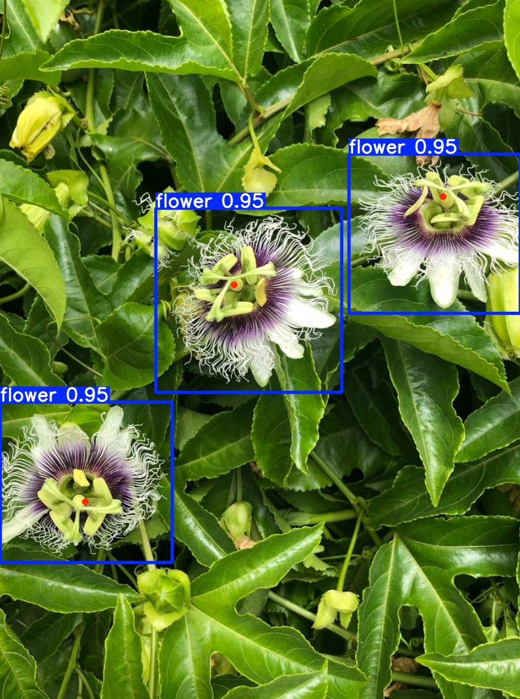
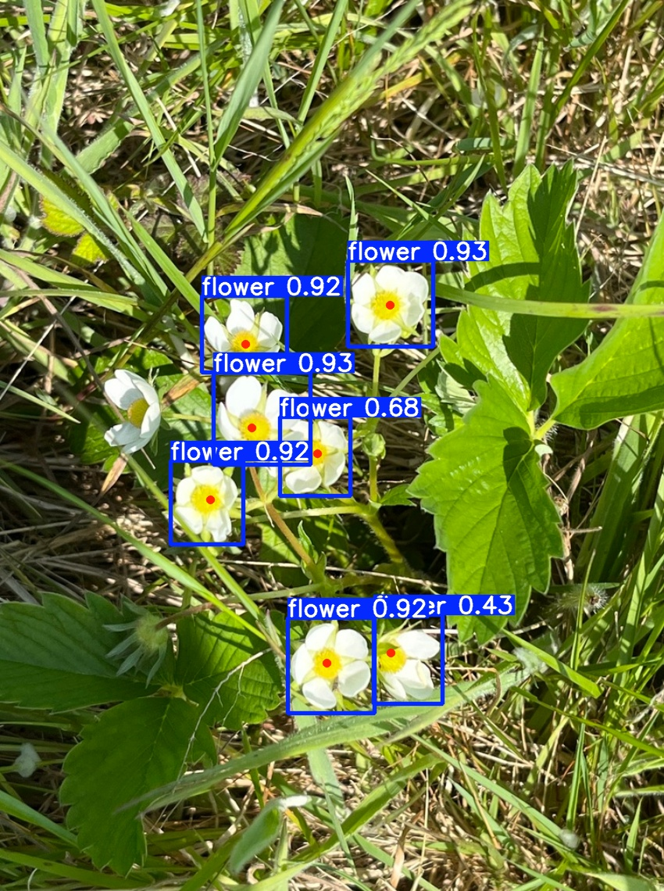

## Standard Protocol

### Flower Instance Detection

| Method | Precision | Recall | mAP@0.5 | mAP@0.5:0.95 |
|---|---:|---:|---:|---:|
| YOLOv8-detect | 0.987 | 0.987 | 0.994 | 0.940 |
| RT-DETR | 0.986 | 0.982 | 0.993 | 0.941 |
| Faster R-CNN | 0.934 | 0.988 | 0.989 | 0.886 |

### Stigma Instance Segmentation

| Method | IoU | StrictIoU | mAP@0.5 | mAP@0.5:0.95 |
|---|---:|---:|---:|---:|
| YOLOv8-seg | 0.867 | 0.846 | 0.974 | 0.794 |
| Mask R-CNN | 0.872 | 0.841 | 0.963 | 0.775 |
| Mask2Former | 0.863 | 0.837 | 0.956 | 0.739 |

### Pollination Point Localization

| Method | Pose mAP50 | StrictDist | StrictPCK@0.05 | StrictPCK@0.10 |
|---|---:|---:|---:|---:|
| YOLOv8-pose | 0.994 | 0.183 | 0.138 | 0.378 |
| YOLO11-pose | 0.994 | 0.216 | 0.131 | 0.356 |
| Keypoint R-CNN | 0.962 | 0.123 | 0.399 | 0.752 |

## Challenging Protocol

### Flower Instance Detection

| Method | Precision | Recall | mAP@0.5 | mAP@0.5:0.95 |
|---|---:|---:|---:|---:|
| YOLOv8-detect | 0.935 | 0.855 | 0.902 | 0.730 |
| RT-DETR | 0.922 | 0.876 | 0.911 | 0.733 |
| Faster R-CNN | 0.951 | 0.698 | 0.735 | 0.545 |

### Stigma Instance Segmentation

| Method | IoU | StrictIoU | mAP@0.5 | mAP@0.5:0.95 |
|---|---:|---:|---:|---:|
| YOLOv8-seg | 0.595 | 0.573 | 0.795 | 0.499 |
| Mask R-CNN | 0.599 | 0.568 | 0.714 | 0.478 |
| Mask2Former | 0.649 | 0.619 | 0.759 | 0.455 |

### Pollination Point Localization

| Method | Pose mAP50 | StrictDist | StrictPCK@0.05 | StrictPCK@0.10 |
|---|---:|---:|---:|---:|
| YOLOv8-pose | 0.905 | 0.230 | 0.068 | 0.226 |
| YOLO11-pose | 0.922 | 0.237 | 0.075 | 0.226 |
| Keypoint R-CNN | 0.722 | 0.257 | 0.202 | 0.412 |

## Notes

- The full benchmark results require access to the complete PolliFlower dataset.
- The public sample data are provided for format inspection and script sanity checks only.
- StrictIoU is an operation-oriented stigma segmentation metric. In the reported setting, a predicted stigma mask must cover at least 80% of the ground-truth stigma region to receive its IoU score; otherwise, the StrictIoU score is assigned zero.
- StrictDist and StrictPCK normalize pollination-point localization error by the stigma scale, making them more aligned with operation-level pollination accuracy than raw pixel error.
